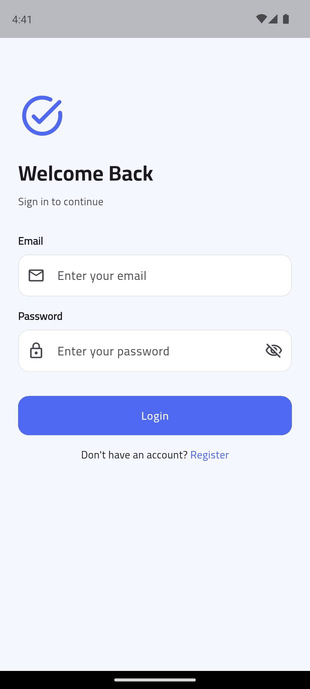
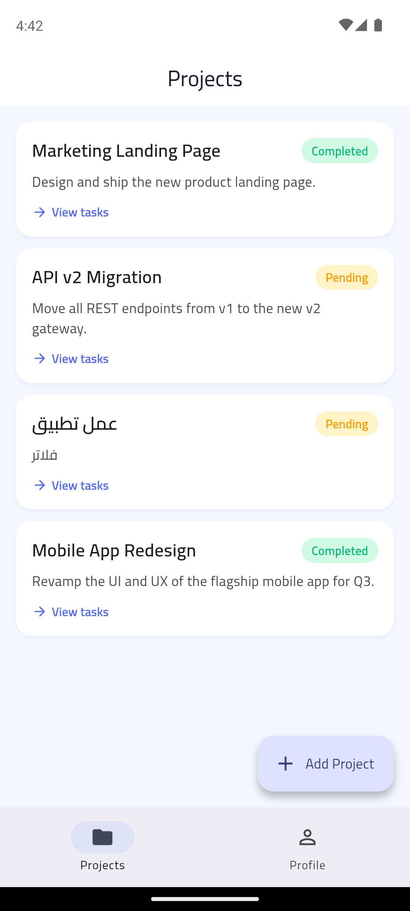
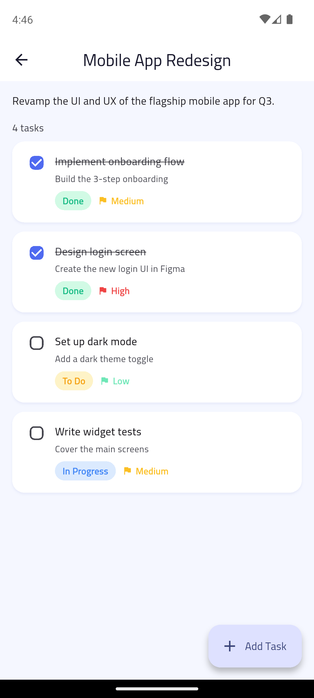
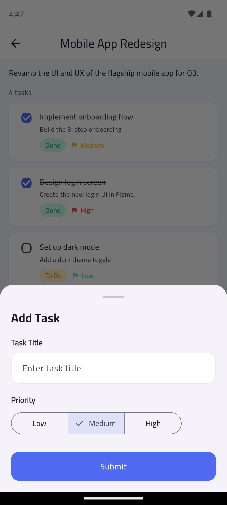
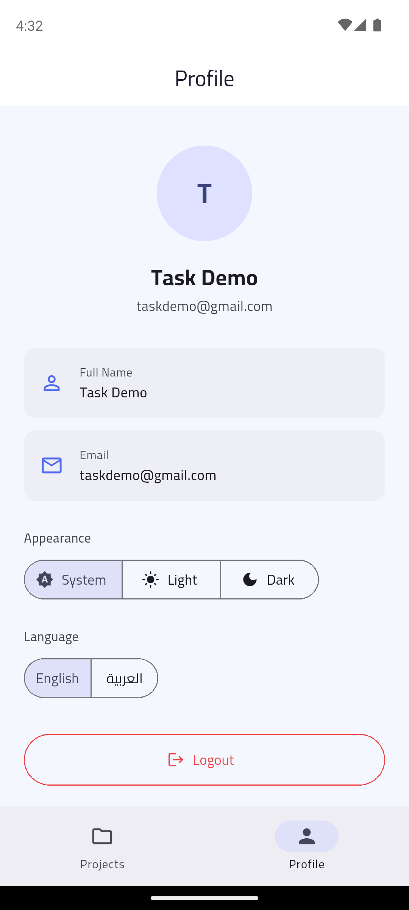
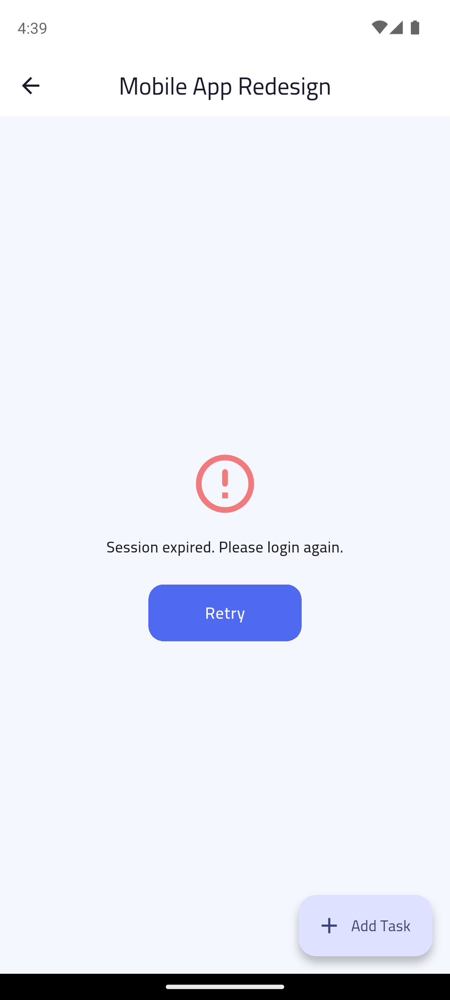
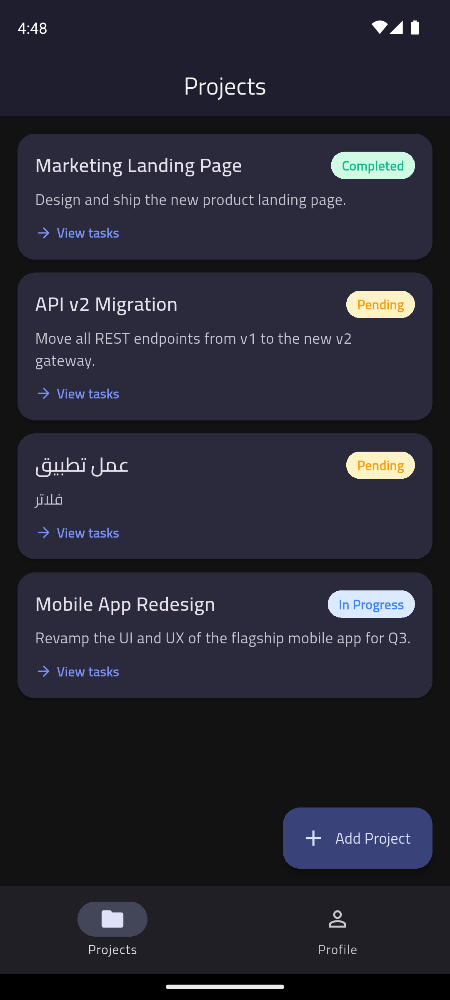
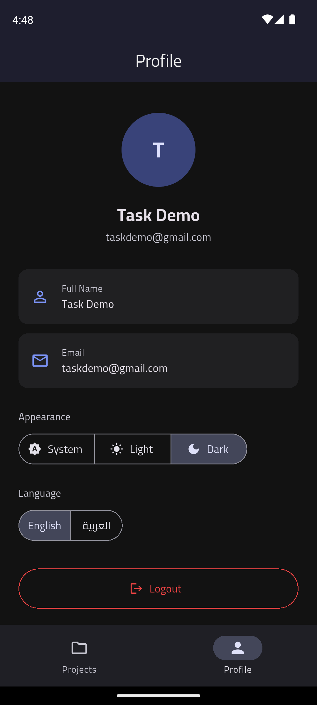
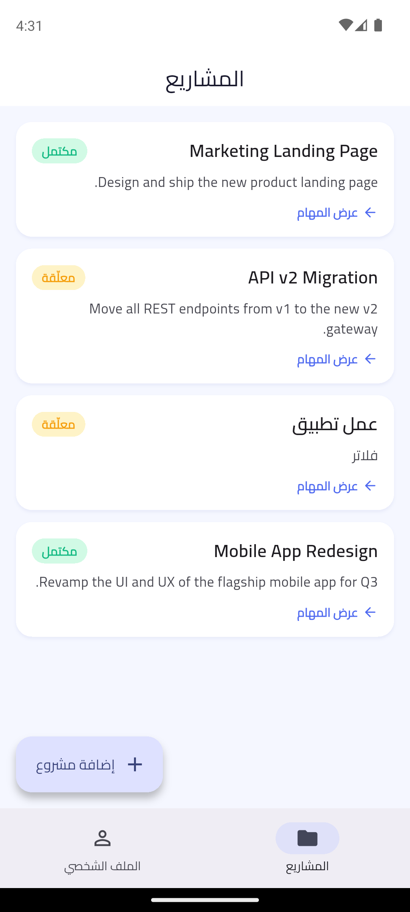
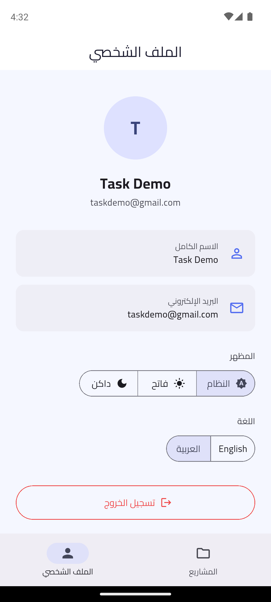

# 📋 Task Manager

A clean, well-structured **Flutter** task management app built for the **Electro Pi** technical assessment. It integrates with a **Supabase** REST backend and demonstrates Clean Architecture, BLoC/Cubit state management, secure authentication, and graceful error handling.

---

## ✨ Features

### 🔐 Authentication
- Login (email + password) and registration (name + email + password)
- JWT token stored securely via `flutter_secure_storage`
- **Auto-login** — a valid cached session skips straight to the home screen
- Auth-aware routing: protected routes redirect to login when unauthenticated

### 🗂️ Projects
- List of projects fetched from the API (title, description, status)
- **Pull-to-refresh**
- **Empty state** when no projects exist
- **Error state** with a Retry action on failure

### ✅ Project Details / Tasks
- All tasks belonging to the selected project
- Each task shows **title, status** (To Do / In Progress / Done) and **priority** (Low / Medium / High)
- **Mark a task as done** with an instant UI update
- **Add a new task** via a bottom sheet (title + priority)

### 👤 Profile / Settings
- Displays the logged-in user's name and email
- **Theme control** — System / Light / Dark selector
- **Language toggle** — English / العربية
- **Logout** (with confirmation) — clears the token and returns to login

### 🎁 Bonus
- **Dark mode** — full light & dark themes with an in-app **System / Light / Dark** selector (persisted)
- **Localization** — full **English ↔ Arabic** toggle with automatic **RTL** layout and an Arabic-friendly font (Cairo); preference persisted
- **Create Project** — users create their own projects in-app (bottom sheet), so the list is never empty
- **Auto project status** — a project's status updates automatically as its tasks progress (all done → *Completed*, work started → *In Progress*, none started → *Pending*)
- Reusable, consistent design-system widgets

---

## 📸 Screenshots

### Core flow
| Login | Projects | Project Details | Add Task |
|:---:|:---:|:---:|:---:|
|  |  |  |  |

### Profile, error handling & dark mode
| Profile / Settings | Error + Retry | Projects (Dark) | Profile (Dark) |
|:---:|:---:|:---:|:---:|
|  |  |  |  |

### Arabic 🇪🇬 (full RTL)
| Projects (العربية) | Profile (العربية) |
|:---:|:---:|
|  |  |

---

## 🛠️ Tech Stack

| Category | Choice |
|----------|--------|
| Framework | Flutter (stable) |
| Language | Dart |
| State Management | **flutter_bloc** (Cubit) |
| Architecture | **Clean Architecture** (Presentation / Domain / Data) |
| HTTP Client | **Dio** (with interceptors) |
| Functional Errors | **fpdart** — `Either<Failure, T>` |
| Navigation | **go_router** (named routes + auth redirect) |
| Dependency Injection | **get_it** |
| Secure Storage | **flutter_secure_storage** |
| Value Equality | **equatable** |
| Localization | **flutter_localizations** + **gen-l10n** (ARB) — English & Arabic |
| Backend | **Supabase** (Auth + PostgREST + RLS) |

---

## 🏗️ Architecture

The app follows **Clean Architecture** with a strict dependency rule: the UI depends on the Domain, the Data layer depends on the Domain, and the Domain depends on nothing.

```
┌──────────────────────────────────────────┐
│              PRESENTATION                  │  flutter_bloc, go_router, widgets
│        (Cubit · Screen · Widget)           │
└───────────────────┬────────────────────────┘
                    │ depends on
┌───────────────────▼────────────────────────┐
│                 DOMAIN                      │  equatable, fpdart
│   (Entity · Repository I/F · UseCase)       │  ← no Flutter, no Dio, no Supabase
└───────────────────┬────────────────────────┘
                    │ depends on
┌───────────────────▼────────────────────────┐
│                  DATA                       │  dio, flutter_secure_storage
│  (Model · DataSource · Repository Impl)     │
└─────────────────────────────────────────────┘
```

### Data flow
```
Screen → Cubit → UseCase → Repository → NetworkCallHandler → DataSource → Dio → Supabase
   ↑        ↑                  ↑                                              ↓
BlocBuilder fold()      Either<Failure,T>                       Model.fromJson() → Entity
```

### Key patterns
- **`NetworkCallHandler`** — a single class wraps every API call, converting `DioException`/exceptions into typed `Failure`s. Repositories become one-liners and contain **zero** try/catch.
- **`Either<Failure, T>` (fpdart)** — every repository/use case returns an `Either`; cubits `fold` it into success/error states.
- **Services layer** — OS concerns (secure storage) sit behind abstract interfaces, injected via `get_it` for easy testing/swapping.
- **Reusable widgets** — buttons, text fields, loading, error, empty-state and status badge live in `core/widgets` and are used across all features.

---

## 📁 Folder Structure

```
lib/
├── core/
│   ├── constants/      # API constants, colors, fallback strings
│   ├── di/             # get_it injection container
│   ├── errors/         # Exceptions & Failures (Equatable)
│   ├── extensions/     # BuildContext (theme, l10n, snackbars), String, Either helpers
│   ├── network/        # Dio client, Supabase interceptor, NetworkCallHandler
│   ├── router/         # GoRouter + auth redirect
│   ├── services/       # LocalStorageService (abstract) + secure impl
│   ├── theme/          # Light & dark ThemeData, text styles
│   ├── usecases/       # Base UseCase<T, P> + NoParams
│   ├── utils/          # Input validators
│   └── widgets/        # Reusable UI components
│
├── features/
│   ├── auth/           # Login, Register, auto-login, logout
│   ├── projects/       # Projects list + create project
│   ├── tasks/          # Project details, tasks, add task
│   ├── profile/        # Profile + settings (theme/language)
│   ├── settings/       # SettingsCubit (theme + locale)
│   └── home/           # Bottom-nav shell
│
├── l10n/               # ARB files (en/ar) + generated AppLocalizations
├── app.dart            # MaterialApp.router + themes + locale + providers
└── main.dart           # DI init + runApp
```

Each feature is split into `data/`, `domain/`, and `presentation/` layers.

---

## 🚦 State Management

The app uses **Cubit** consistently across every feature. States are immutable and use `Equatable` to avoid unnecessary rebuilds. Example (Projects):

```
ProjectsInitial → ProjectsLoading → ProjectsLoaded(List<ProjectEntity>)
                                   ↘ ProjectsError(message)
```

Loading, success, empty, and error are explicit states, so the UI never has to guess.

---

## ⚠️ Error Handling

- Network/timeouts → `NetworkFailure` ("No internet connection")
- HTTP 401 → session cleared + the app **auto-redirects to login** (the Dio interceptor notifies the `AuthCubit`, which the router listens to)
- Server errors → `ServerFailure` (message extracted from the Supabase response)
- Every failure surfaces to the user as either an inline **error widget with Retry** or a **snackbar** — never a crash or a blank screen.

---

## 🚀 Getting Started

### Prerequisites
- Flutter SDK (stable channel)
- A device/emulator (Android, iOS, or desktop)

### Run
```bash
# 1. Install dependencies (also generates the localization files)
flutter pub get

# 2. Run the app
flutter run

# 3. (optional) Run the tests
flutter test
```

### Demo credentials
A pre-seeded demo account with sample projects and tasks:
```
Email:    taskdemo@gmail.com
Password: Demo12345!
```
You can also register a fresh account from the app.

---

## 🔌 Backend / API Notes

The backend is **Supabase** (hosted PostgreSQL + Auth + PostgREST).

- **Auth**: `POST /auth/v1/token?grant_type=password` (login), `POST /auth/v1/signup` (register)
- **Projects**: `GET /rest/v1/projects?select=*`
- **Tasks**: `GET /rest/v1/tasks?project_id=eq.{id}`, `POST`, `PATCH`

### Security
- The app ships only the **publishable (client-safe) key** — never a secret key.
- **Row Level Security (RLS)** on the backend governs data access per authenticated user; every request carries the user's JWT (injected by a Dio interceptor), so users only see and manage their own data.

### Backend enums
- `task_status`: `TO_DO`, `IN_PROGRESS`, `DONE`
- `priority`: `low`, `medium`, `high`
- project `status`: `pending`, `in_progress`, `completed`

---

## 📝 Implementation Notes

- **Auto-login** is driven by `GoRouterRefreshStream`, which listens to the `AuthCubit` stream and re-runs the redirect logic on every auth change.
- **JWT** is stored under the key `auth_token`; the cached user profile under `user_data`.
- **Task → Project status sync** is computed client-side and persisted via a `PATCH` to the project, then reflected in the list on return.
- The **Profile** screen reads the authenticated user directly from `AuthCubit` (single source of truth) rather than re-fetching.
- **Theme & language** preferences are persisted in secure storage and **survive logout** (`clearAll()` only wipes the auth session).

---

## 🧪 Testing

Unit tests cover the BLoC layer using `bloc_test` + `mocktail` (mocked use cases):

```bash
flutter test
```

`ProjectsCubit` is tested for both the success path (`Loading → Loaded`) and the
failure path (`Loading → Error`).

---

## ✅ Assessment Checklist

| Requirement | Status |
|-------------|--------|
| Authentication screens (login/register) | ✅ |
| Store JWT securely + auto-navigate | ✅ |
| Projects list (title/description/status, pull-to-refresh, empty state) | ✅ |
| Project details (tasks, status, priority, mark done, add task) | ✅ |
| Profile (name, email, logout) | ✅ |
| Separated UI / business / data layers (Clean Architecture) | ✅ |
| Consistent state management (BLoC/Cubit) | ✅ |
| Loading states + error handling | ✅ |
| Responsive, scroll-safe layouts | ✅ |
| Named routes / GoRouter | ✅ |
| Reusable widgets | ✅ |
| **Bonus** — Dark mode | ✅ |
| **Bonus** — Localization (English / Arabic + RTL) | ✅ |
| **Bonus** — Create Project in-app | ✅ |
| **Bonus** — Unit tests | ✅ |
